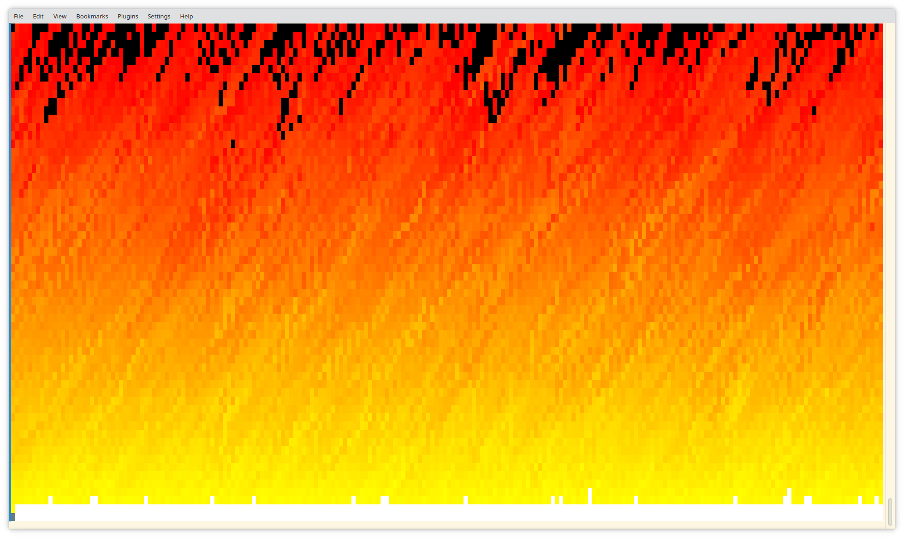

I stole this algo from somewhere, but it was a long time ago.<br/>
The basic idea originated in Doom's intro screen AFAIK.<br/>
This one runs in the console, press any key to exit.

```
git clone https://github.com/codr7/sharpl.git
cd sharpl
dotnet run examples/doom-fire/fire.sl
```